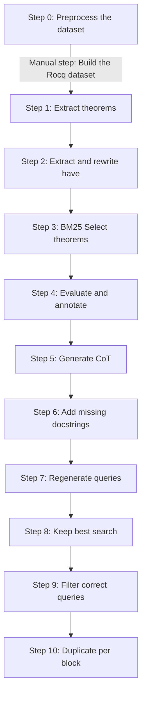

# Dataset generation

This document describes the step-by-step process to generate the final datasets to train Crrrocq.

## Requirements

- Install [petanqueV2](petanqueV2.md)
- If working with mathcomp, install it by following these [guidelines](mathcomp_installation.md)
- Install all dependencies in [requirements_dataset.txt](../requirements_dataset.txt)

## Diagram



## Usage

To avoid issues like file collisions, corruption, and for easier debugging and adaptability, we implement a step-by-step pipeline.
Each step depends on the output of the previous one; input/output paths can be customized as needed.

To perform the step i, run the following command:
```
$ python -m src.dataset.steps.step_i.exec [ARGUMENTS]
```

For example, to perform the step 0 on your dataset, run:
```
$ python -m src.dataset.steps.step_0.exec --input path_to_my_dataset
```

The default dataset for the pipeline is [mathcomp](mathcomp_installation.md). If downloaded in "export/mathcomp", specifying input and output paths is not required.

### Step 0

*Description*: keeps only Rocq and Make files and removes comments in Rocq files.

*Arguments*:
- `--input`: input path of the dataset, default is "export/mathcomp"
- `--output`: output directory of this step, default is "export/output/steps/step_0"

**Manual step**:
For all subsequent steps, petanque servers use the dataset outputed by the step 0 as a reference, so make sure the Rocq project is properly built for petanque to work.
For example, once the step 0 is completed with the default mode for mathcomp, run `make` in "export/output/steps/step_0/mathcomp".

### Step 1

*Description*: saves all the theorems of the dataset into a json file.

*Arguments*:
- `--input`: output path of the previous step, default is "export/output/steps/step_0/mathcomp"
- `--output`: output directory of this step, default is "export/output/steps/step_1"

### Step 2

*Description*: encloses all have tactics and their proofs inside of `(*<have>*)` and `(*</have>*)` tags, rewrites the proofs if necessary.

*Arguments*:
- `--input`: output path of the previous step, default is "export/output/steps/step_1/mathcomp.json"
- `--output`: output directory of this step, default is "export/output/steps/step_2"
- `--pet-timeout`: timeout value when running a tactic, default is 40
- `--max-workers`: number of petanque servers running concurrently, default is 8

### Step 3

*Description*: selects a diverse set of theorems using BM25.

*Arguments*:
- `--input`: output path of the previous step, default is "export/output/steps/step_2/mathcomp.json"
- `--output`: output directory of this step, default is "export/output/steps/step_3"
- `--k-have`: number of theorems containing have tactics, default is 500
- `--k-wo-have`: number of theorems without a have tactic, default is 500

### Step 4

*Description*: extracts notations and dependencies in theorems statements, finds global variables of theorems, decomposes proofs tactic by tactic, extracts dependencies from each tactic, shows goals evolution from tactic to tactic; notations and dependencies are annotated with docstrings given in a dictionary file.

*Arguments*:
- `--input`: output path of the previous step, default is "export/output/steps/step_3/mathcomp.json"
- `--output`: output directory of this step, default is "export/output/steps/step_4"
- `--dictionary`: path of the dictionary, default is "export/docstrings/dictionary.json"
- `--max-workers`: number of petanque servers running concurrently, default is 8

**Dictionary**: for mathcomp, we recommand using [LLM4Docq](https://github.com/LLM4Rocq/LLM4Docq) as dictionary. To illustrate the expected dictionary format, here is a truncated view of LLM4Docq:
```json
{
    "objects": [
        {
            "keys": [
                "mathcomp.algebra.polydiv.Pdiv.RingMonic.rdivpp",
                "mathcomp.algebra.polydiv.Pdiv.RingMonic.RingMonic.rdivpp",
                "mathcomp.algebra.polydiv.Pdiv.RingMonic.RingMonic.MonicDivisor.rdivpp"
            ],
            "value": {
                "kind": "Lemma",
                "name": "rdivpp",
                "fullname": "Lemma rdivpp : rdivp d d = 1.",
                "line": 543,
                "historic": [
                    {
                        "name": "Pdiv",
                        "kind": "module"
                    },
                    {
                        "name": "RingMonic",
                        "kind": "module"
                    },
                    {
                        "name": "RingMonic",
                        "kind": "section"
                    },
                    {
                        "name": "MonicDivisor",
                        "kind": "section"
                    }
                ]
            }
        },
        ...
    ],
    "notations": {
        "scope": {
            "ring_scope": {
                "mathcomp.algebra.mxpoly.MapRingMatrix.\"A ^f\"": {
                    "kind": "Notation",
                    "name": "\"A ^f\"",
                    "fullname": "Local Notation \"A ^f\" := (map_mx (GRing.RMorphism.sort f) A) : ring_scope.",
                    "scope": "ring_scope",
                    "line": 782,
                    "body": "(map_mx (GRing.RMorphism.sort f) A)",
                    "historic": [
                        {
                            "name": "MapRingMatrix",
                            "kind": "section"
                        }
                    ]
                },
                ...
            },
            ...
        },
        "noscope": {
            "mathcomp.algebra.mxpoly.\"A ~_ P B\"": {
                "kind": "Notation",
                "name": "\"A ~_ P B\"",
                "fullname": "Notation \"A ~_ P B\" :=  (simmx_for P A B) (format \"A  ~_ P  B\").",
                "scope": "",
                "line": 1674,
                "body": "(simmx_for P A B) (format \"A  ~_ P  B\")",
                "historic": []
            },
            ...
        }
    }
}
```

### Step 5

*Description*: generates the Chains of Thought (CoT) for each theorem.

*Arguments*:
- `--input`: output path of the previous step, default is "export/output/steps/step_4/mathcomp.json"
- `--output`: output directory of this step, default is "export/output/steps/step_5"
- `--max-workers`: number of petanque servers running concurrently, default is 8

### Step 6

Add missing docstrings to dependencies using an LLM.

You can control the number of concurrent workers and set the average delay to balance the API requests:

```console
python -m src.steps.step_6.exec --max-workers 100 --mean-delay 10
```

### Step 7

Regenerate search queries for failed searches using an LLM.

You can control the number of concurrent workers, delay, and top-k for retrieval:

```console
python -m src.steps.step_7.exec --max-workers 100 --mean-delay 10 --top-k 10
```

### Step 8

Keep only the best search result for each query.

You can select the embedding model, device, batch size (to generate embeddings), and top-k:

```console
python -m src.steps.step_8.exec --model-name qwen_embedding_4b --device cpu --batch-size 32 --top-k 10
```

### Step 9

Keep only entries with at least one correct search query per target.

You can set the top-k parameter and optionally plot the proof length histogram:

```console
python -m src.steps.step_9.exec --top-k 10 --plot-hist False
```

### Step 10

Duplicate entries to keep at most one result per type of block (e.g., only the last search or script result).

```console
python -m src.steps.step_10.exec
```
