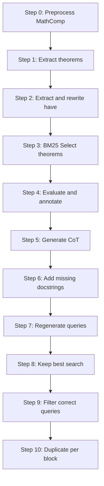

# Dataset generation

This document describes the step-by-step process to generate the final datasets to train Crrrocq.

## Requirements

- Install [Pytanque/Petanque v2](https://github.com/LLM4Rocq/pytanque/tree/PetanqueV2).
- Install all dependencies in requirements_dataset.txt

## Diagram



## Usage

To avoid issues like file collisions, corruption, and for easier debugging and adaptability, we implement a step-by-step pipeline.
Each step depends on the output of the previous one; input/output paths can be customized as needed.

### Step 0

To preprocress mathcomp (clean comment, keep source file only etc.) replace $MATHCOMP_PATH by a directory containing a copy of mathcomp (e.g. [this fork](https://github.com/theostos/math-comp)) (default to export/mathcomp).

```console
python -m src.steps.step_0.exec --input $MATHCOMP_PATH
```

(By default, output is set to "export/outputs/steps/step_0")

### Step 1

Extract all theorems from mathcomp.

```console
python -m src.steps.step_1.exec
```

### Step 2

Extract all have, rewrite them if necessary.

```console
python -m src.steps.step_2.exec --max-workers 4
```

To extract "have" using 4 workers.

### Step 3

Extract a diverse set of theorems using BM25.

```console
python -m src.steps.step_3.exec --k_have 500 --k_wo_have 500
```
To extract a diverse set of 500 theorems with "have" statements, and 500 without "have" statements.

### Step 4

Evaluate all theorems (goals, dependencies, etc.), and annotate theorems with docstrings given in a dictionary file.
To obtain docstring we recommend using [LLM4Docq](https://github.com/LLM4Rocq/LLM4Docq).

Expected dictionary format:

- fully qualified name
    + name
    + kind
    + docstring
    + fullname

An example
- "mathcomp.fingroup.action.act_morph":
    + "name": "act_morph",
    + "kind": "Definition",
    + "docstring": "The property that for a function to, applying to to an element x and the product of two group elements a and b is the same as applying to to x and a, and then applying to again to the result and b. This expresses the composition law required for a group action.",
    + "fullname": "Definition act_morph to x := forall a b, to x (a * b) = to (to x a) b."

```console
python -m src.steps.step_4.exec --dictionary=export/docstrings/dictionary.json --max-workers 4
```

### Step 5

Generate **synthetic chains of thought (CoT)** for each theorem.

You can control the number of concurrent workers:

```console
python -m src.steps.step_5.exec --max-workers 8
```

### Step 6

Add missing docstrings to dependencies using an LLM.

You can control the number of concurrent workers and set the average delay to balance the API requests:

```console
python -m src.steps.step_6.exec --max-workers 100 --mean-delay 10
```

### Step 7

Regenerate search queries for failed searches using an LLM.

You can control the number of concurrent workers, delay, and top-k for retrieval:

```console
python -m src.steps.step_7.exec --max-workers 100 --mean-delay 10 --top-k 10
```

### Step 8

Keep only the best search result for each query.

You can select the embedding model, device, batch size (to generate embeddings), and top-k:

```console
python -m src.steps.step_8.exec --model-name qwen_embedding_4b --device cpu --batch-size 32 --top-k 10
```

### Step 9

Keep only entries with at least one correct search query per target.

You can set the top-k parameter and optionally plot the proof length histogram:

```console
python -m src.steps.step_9.exec --top-k 10 --plot-hist False
```

### Step 10

Duplicate entries to keep at most one result per type of block (e.g., only the last search or script result).

```console
python -m src.steps.step_10.exec
```